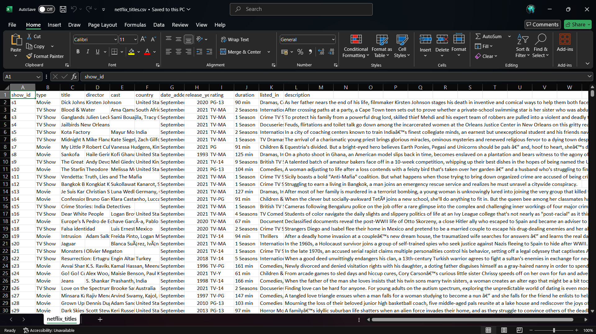
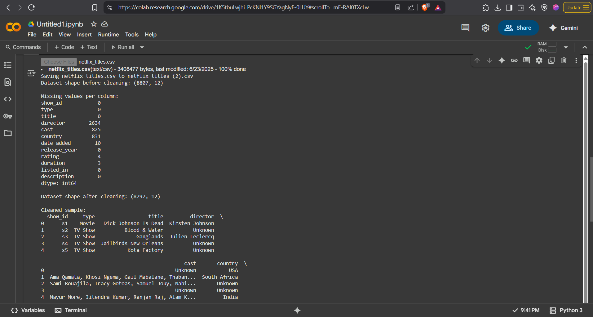
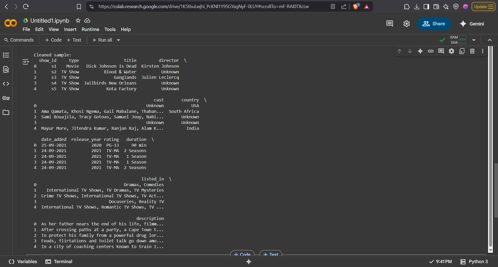
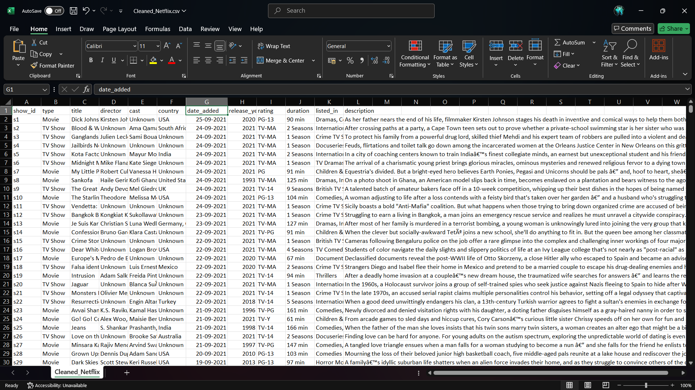

# 🎬 Netflix Data Cleaning with Python & Pandas

This project focuses on cleaning and preprocessing the **Netflix Movies and TV Shows dataset** using Python and Pandas. The dataset contains information about titles available on Netflix, such as cast, director, release year, duration, and more.

---

## 📦 Dataset

- **File Name:** `netflix_titles.csv`
- **Rows:** 8807
- **Columns:** 12
- **Source:** [Kaggle Netflix Dataset](https://www.kaggle.com/datasets/shivamb/netflix-shows?resource=download)

---

## 🚀 What This Project Does

- ✅ Handles missing values (`fillna`)
- ✅ Removes duplicate rows
- ✅ Standardizes text data (like country names)
- ✅ Rename columns headers to lowercase & remove spaces
- ✅ Converts date formats to `dd-mm-yyyy`
- ✅ Cleans data types (e.g., `date_added` as datetime)

---

## 🧠 Technologies Used

| Tool | Purpose |
|------|---------|
| Python | Core language |
| Pandas | Data manipulation |
| Google Colab | Notebook environment |
| CSV | Data input/output |

---

## 🧹 Cleaning Steps Overview

1. Loaded dataset with `pandas.read_csv()`
2. Identified and filled missing values with `'Unknown'`
3. Removed duplicate entries
4. Stripped extra spaces and standardized values (e.g., `USA`, `UK`)
5. Converted `date_added` to datetime and formatted as `dd-mm-yyyy`
6. Exported the cleaned dataset to `Cleaned_Netflix.csv`

---

## 📁 Project Files

| File | Description |
|------|-------------|
| `netflix_cleaning.ipynb` | Main Google Colab notebook |
| `netflix_title.csv` | Input dataset |
| `Cleaned_Netflix.csv` | Final cleaned dataset |
| `screenshots` | Screenshots |
| `README.md` | Project description and instructions |

---

## 🖼️ Screenshots

### ▶️ 1. Dataset Before Cleaning
Shows the raw dataset with missing values, inconsistent formats, and duplicates.

---

### 🧹 2. Cleaning Process in Google Colab
Includes code for handling missing values, formatting dates, and standardizing text.

---

### ✅ 3. Final Cleaned Data Output
A preview of the cleaned dataset saved as `Cleaned_Netflix.csv`.

---

## ✅ How to Use

1. Clone this repo or download the files
2. Open `netflix_cleaning.ipynb` in Google Colab or Jupyter Notebook
3. Run each cell to see how the data is cleaned step-by-step
4. Final cleaned CSV is saved as `Cleaned_Netflix.csv`

---

## 📌 To Do (Future Improvements)

- Add visualizations using Matplotlib or Seaborn
- Group and analyze titles by country/year
- Build a dashboard or interactive filter

---

## 📌 License

This project is licensed under the **MIT License** – see the [LICENSE](./LICENSE) file for details.
